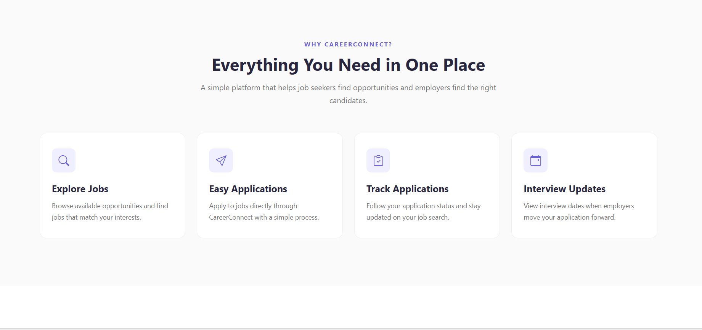
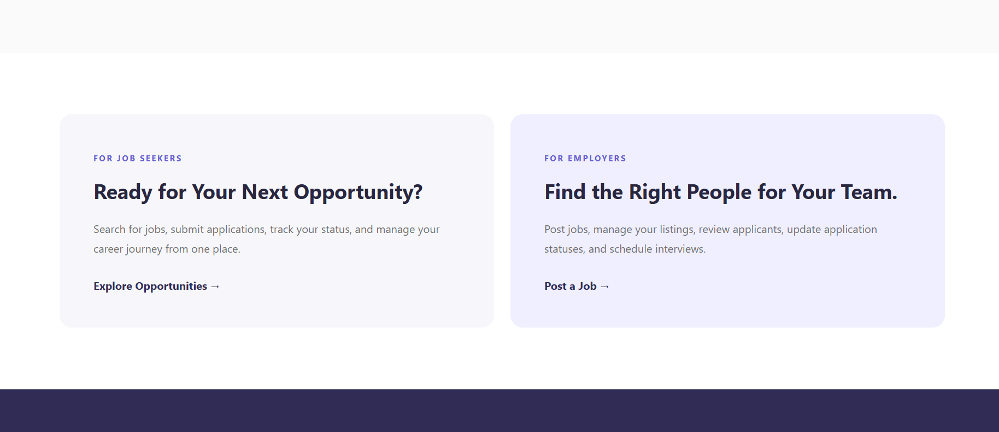
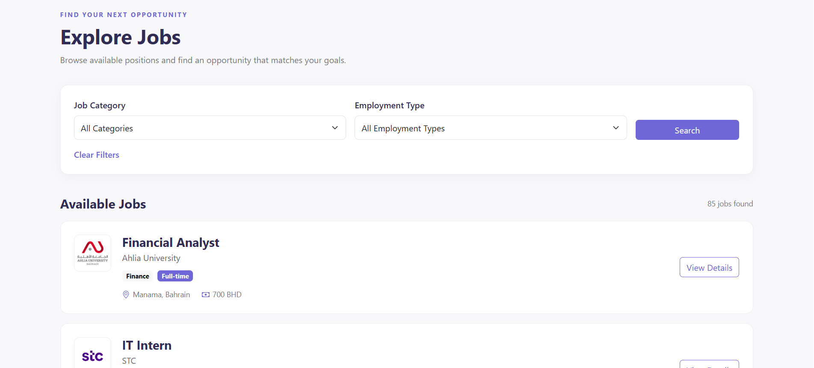
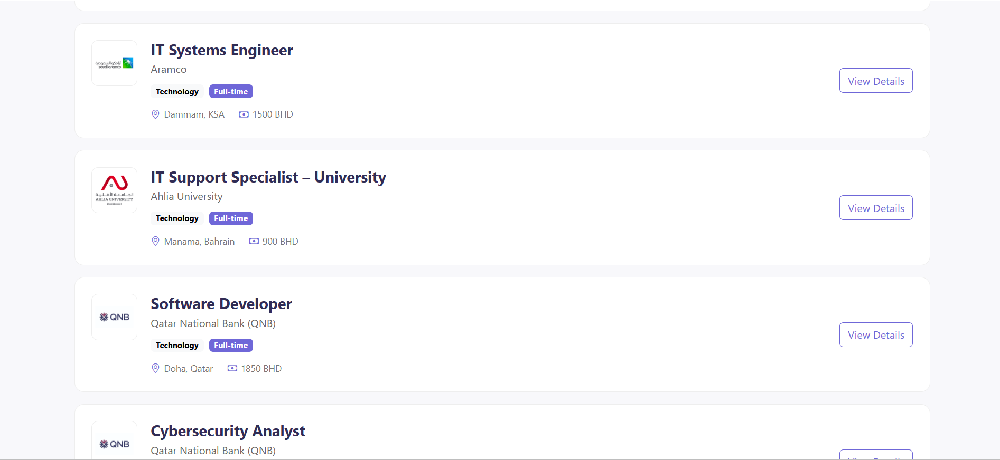
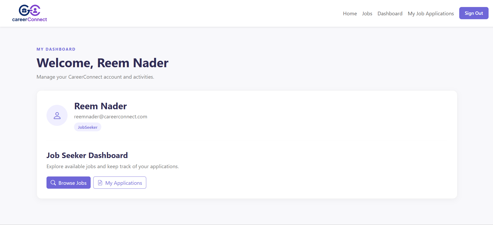
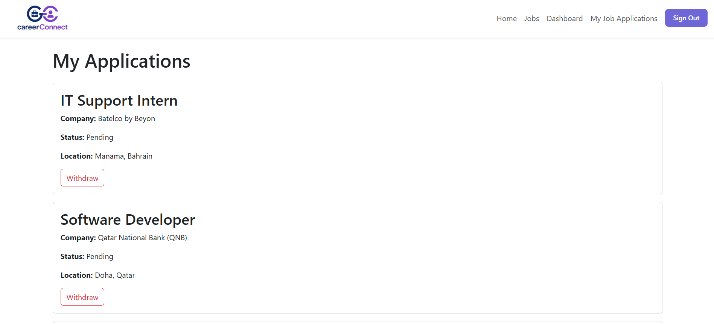
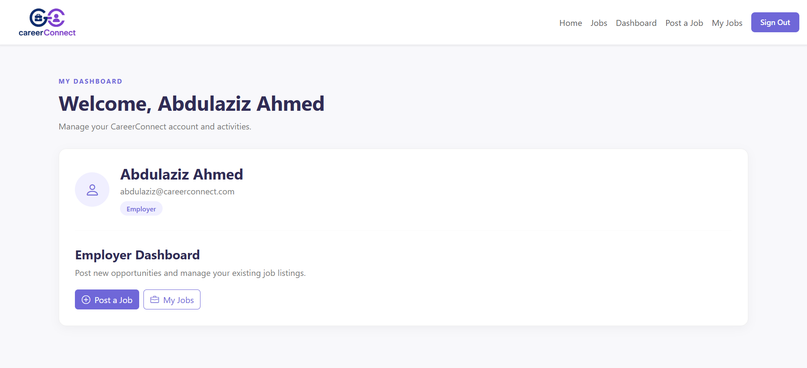
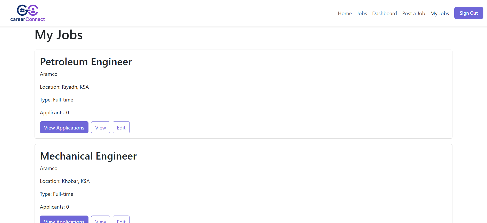
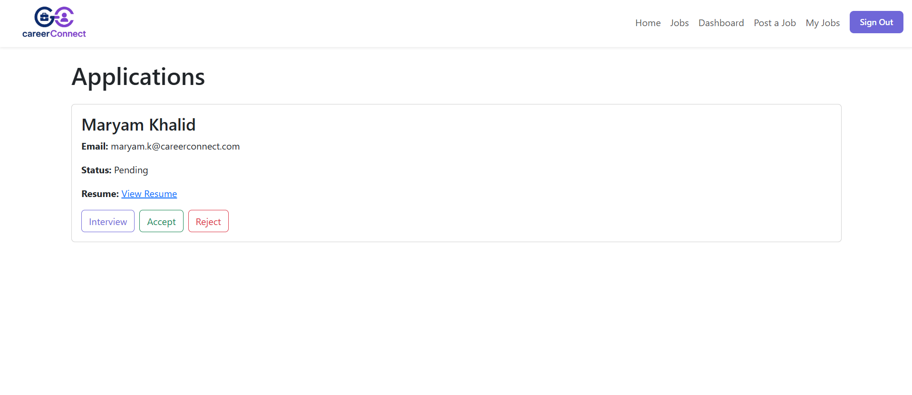
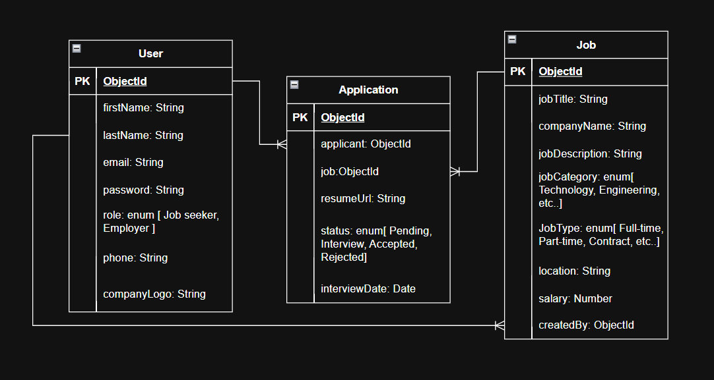

# CareerConnect 🧾📍

## Overview

Career Connect is a full-stack job platform designed to connect Job Seekers with Employers. The application allows Employers to create and manage job postings, while Job Seekers can browse, search, filter, and apply for available opportunities.

The platform includes JWT authentication and role-based access, providing different functionality for Employers and Job Seekers. Employers can manage their job listings, review applications, and schedule interviews using a selected date and time. Job Seekers can apply for jobs, withdraw applications, and view scheduled interview details directly from their applications.

Career Connect also provides job search and filtering based on job categories such as IT, Finance, Healthcare, and more, as well as employment type, making it easier for users to find relevant. 

## Screenshots

#### Home Page 
 

### Jobs Page 

 

#### Job Seeker dashboard page 

#### Job application page 

#### Employer dashboard page 

#### Jobs created by Employer : 

#### Application page where the Employer can view / accept / reject and booked an interview with the applicants  

## Technologies Used 

#### Frontend

- React
- React Router
- CSS
- Axios
- Context API
- JWT Authentication

#### Backend

- Node.js
- Express.js
- MongoDB
- Mongoose
- JWT
- bcrypt

## User Stories

### Job seeker (Backend)

- As a backend developer, I want to register and authenticate Job Seekers using JWT.

- As a backend developer, I want to protect private routes using authentication middleware.

- As a backend developer, I want to validate user credentials before allowing sign in.

- As a backend developer, I want to return all available jobs.

- As a backend developer, I want to return a single job by its ID.

- As a backend developer, I want to save a Job Seeker's application in the database.

- As a backend developer, I want to prevent duplicate job applications.

- As a backend developer, I want to return all applications for the authenticated Job Seeker.

- As a backend developer, I want to ensure Job Seekers can only access their own applications.

- As a backend developer, I want to return the status of each application.

- As a backend developer, I want to return dashboard data for the authenticated Job Seeker only.

### Employer (Backend)

- As backend developer, Register a new Employer account and authenticate them using JWT. 

- As backend developer, protect private routes with authentication middleware. 

- As backend developer, Validate user credentials before granting access. 

- As backend developer, Calculate and return the number of applications for each job. 

- As backend developer, Return dashboard data only for the authenticated employer. 

- As backend developer, Create/Read/Update and Delete job by the authenticated employer. 

- As backend developer, Retrieve a single job by its ID. 

- As backend developer, Store the job application in the Database. 

- As backend developer, Ensure employers can only access applications for jobs they own. 

- As backend developer, Update an application's status. 

## Database Design

## Routes

### API Routes 

| Method | Route         | Description                              |
| ------ | ------------- | ---------------------------------------- |
| POST   | /auth/sign-up | Create a new user account                |
| POST   | /auth/sign-in | Sign in and receive JWT                  |
| GET    | /auth/verify  | Verify authenticated user                |
| GET    | /jobs         | Get all jobs and apply filters           |
| GET    | /jobs/:id     | Get a job by ID                          |
| POST   | /jobs         | Create a new job                         |
| PATCH  | /jobs/:id     | Update a job                             |
| DELETE | /jobs/:id     | Delete a job                             |
| GET    | /jobs/my-jobs | Get jobs created by the current employer |

## Features

- User Authentication : Uses can create an account and sign in in securely using JWT authentication. 

- Role Based Access : Seperate functionality for Employers and Job Seekers. 

- Employer Profiles : Employers can create, update and delete job listings. 

- Job Search & Filtering : Job Seekers can browse available jobs and filter them by : 
- Job Category 
- Employment Type 

- Job Categories : Jobs can be categorized into fields such as { IT, Finance, Healthcare, Markting, Engineering and more }. 

- Application Withdrawal — Job Seekers can withdraw their application from a job.

- Application Management — Employers can view and manage applications submitted for their job postings.

- Interview Scheduling — Employers can schedule interviews by selecting a date and time using a calendar.

- Interview Details — Scheduled interview information, including the date and time, appears in the Job Seeker's job/application details.

- Employer Job Management — Employers can view their posted jobs and see the number of applicants for each position.

- Responsive Job Listings — Job listings display relevant information such as company, location, employment type, salary, and job category. 

## Future Enhancements

- Email Notifications — Send automatic notifications for new applications, interview scheduling, interview updates, and application status changes.
- Advanced Job Search — Add additional filters such as salary range, location, experience level, and remote/hybrid opportunities.
- Job Recommendations — Recommend relevant job opportunities to Job Seekers based on their profile, skills, and preferred job categories. 

